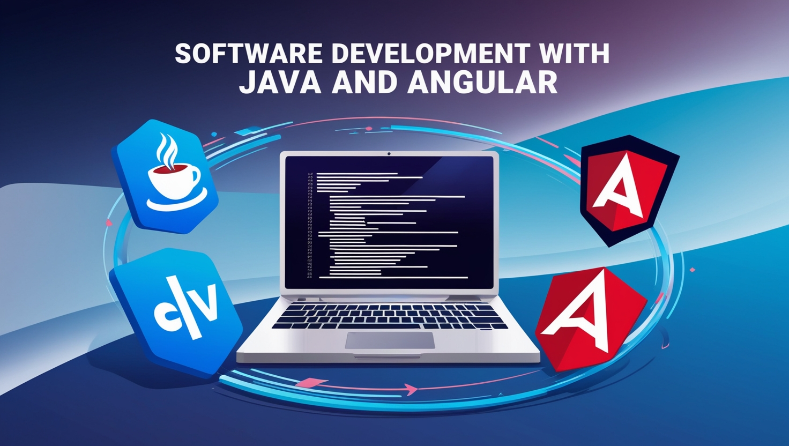

# Hola soy Brayan López!

#### Desarrollador de software

       

 

## Un poco sobre mi

Me encanta enfrentar desafíos tecnológicos y siempre me encuentro en busqueda de mejorar y aprender en cada proyecto.

Con más de 3 años de experiencia en desarrollo de software, tengo habilidades destacadas en:

**Lenguajes de Programación:**

- Java
- JavaScript
- TypeScript
- C++

**Frameworks y Tecnologías:**

- Spring (Spring Boot, Spring Data JPA, Spring Security)
- Angular

**Desarrollo de API’s REST:**

- Diseño y creación de API’s REST eficientes y escalables

**Gestión de Bases de Datos:**

- SQL (PostgreSQL, MySQL, SQL Server)